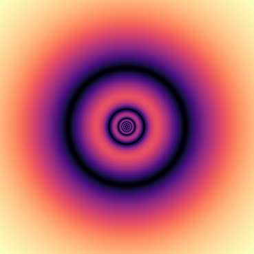

# UIUC SINE

<nav>
    <a href="https://github.com/uiuc-sine">Github</a>
    <a href="reports">Reports</a>
</nav>

## Projects


    
    <a href="{{ site.baseurl }}{{ page.url }}">
        <figure>
            
            
            
            
            
            <figcaption>{{ page.title }}</figcaption>
            
            <figcaption class="description">{{ page.description }}</figcaption>
            
        </figure>
    </a>
    


## Journal Publications

- [High-resolution multi-spectral imaging with diffractive lenses and learned reconstruction](https://ieeexplore.ieee.org/document/9415140)
    - Figen Oktem, Oguzhan Kar, Can Bezek, Farzad Kamalabadi
    - IEEE TCI 2021
- [Estimation of Linear Space-Invariant Dynamics](https://ieeexplore.ieee.org/document/9272542)
    - Helmuth Naumer, Farzad Kamalabadi
    - IEEE Signal Processing Letters, Vol. 27, 2020
- [Bayesian Methods for Joint Exoplanet Transit Detection and Systematic Noise Characterization](https://iopscience.iop.org/article/10.3847/1538-3881/ab8e38/meta)
    - Jamila S. Taaki, Farzad Kamalabadi, Athol J. Kemball
    - Astronomical Journal 159:283, 2020 
- [Slitless Solar Imaging Spectroscopy](https://iopscience.iop.org/article/10.3847/1538-4357/ab372a/meta)
    - Joseph M. Davila, Figen S. Oktem, Farzad Kamalabadi
    - Astrophysical Journal 2019
- [Radio Frequency Interference Detection and Mitigation using Compressive Statistical Sensing](https://agupubs.onlinelibrary.wiley.com/doi/abs/10.1029/2019RS006902)
    - G. Cucho‐Padin, Y. Wang, E. Li, L. Waldrop, Z. Tian, F. Kamalabadi, P. Perillat
    - Radio Science 2019

## Conference Publications

- [Optimal Measurement Configuration In Computational Diffractive Imaging](https://arxiv.org/pdf/2005.11877)
    - Evan Widloski, Ulaʂ Kamacı, Farzad Kamalabadi
    - ICIP 2020 - [Code](https://github.com/UIUC-SINE/MAS/tree/master/reports/ICIP_2020)
- [Marginalization on Bifurcation Diagrams: A New Perspective on Infinite-Horizon Prediction]()
    - Helmuth Naumer, Yizhen Lu, Farzad Kamalabadi
    - IEEE Statistical Signal Processing Workshop (SSP) 2021

## People

    <a href="https://evan.widloski.com">
        <figure>
            
            <figcaption>Evan Widloski</figcaption>
        </figure>
    </a>

    <a href="https://evan.widloski.com">
        <figure>
            
            <figcaption>Evan Widloski</figcaption>
        </figure>
    </a>

    <a href="https://evan.widloski.com">
        <figure>
            
            <figcaption>Evan Widloski</figcaption>
        </figure>
    </a>

    <a href="https://www.helmuthnaumer.com">
        <figure>
            
            <figcaption>Helmuth Naumer</figcaption>
        </figure>
    </a>

